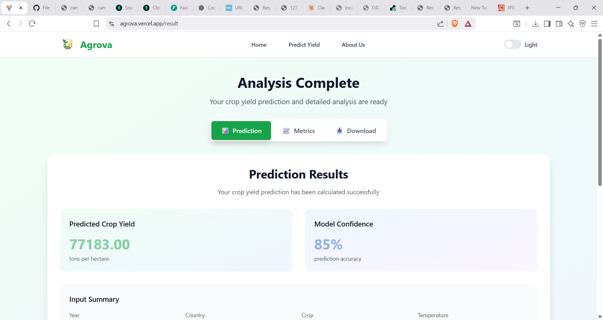
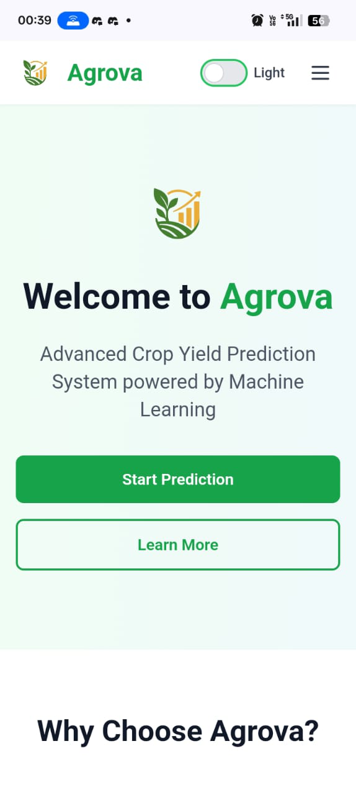

<h1 align="center">
   <span style="color:#2ecc71;">Agrova</span> — Advanced Crop Yield Prediction System powered by Machine Learning
</h1>

<p align="center">
  <i>🌾 Get instant predictions with our real-time analysis system that processes multiple environmental parameters.</i>
</p>


 
---

## 🌐 Live Preview

- 🔗 **Frontend on Vercel:** [agrova.vercel.app](https://agrova.vercel.app/)
- 🔗 **Backend API Docs:** [agrova-backend-2.onrender.com/docs](https://agrova-backend-2.onrender.com/docs)

---

## 📱 Mobile & Desktop View

<div align="center">

### 🖥️ Desktop View


### 📲 Mobile View  


</div>

## ⚙️ Tech Stack

- 🎨 **Frontend:** Vite + React
- 🧠 **Backend:** FastAPI (Python)

- 🚀 **Deployment:** Vercel (Frontend) & Render (Backend)

---

## ✨ Features

- 🌿 Animated, modern green-themed UI  
- 📱 Fully mobile responsive  
- 📊 Visual representation of crop/task data  
- 🔄 CRUD operations with instant feedback  
- 🔗 REST API powered by FastAPI  
- 🎯 **Accurate Predictions**  
  Our advanced ML models provide highly accurate crop yield predictions based on historical data and environmental factors.  
- ⚡ **Real-time Analysis**  
  Get instant predictions with our real-time system that processes multiple environmental parameters.  
- 🧩 **Easy to Use**  
  A simple and intuitive interface designed for farmers and agricultural professionals of all technical levels.  


## 🛠️ Local Development Setup

### 1. Clone the Repository

```bash
git clone https://github.com/Sov-ereign/Agrova.git
cd Agrova
